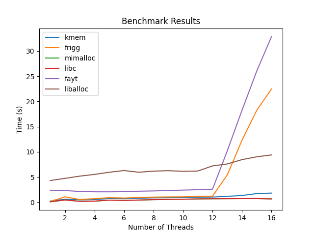

# alloc-benchmark
This repository contains a simple benchmark suite for testing the performance of general-purpose memory allocators in hobby operating systems. 
The benchmark compares different allocators based on their performance under varying numbers of threads.



## Tested Allocators

| Name         | Description                                                                             | Link                                              |
|--------------|-----------------------------------------------------------------------------------------|---------------------------------------------------|
| **mimalloc** | A fast and compact memory allocator designed to perform well in a variety of workloads. | [mimalloc](https://github.com/microsoft/mimalloc) |
| **libc**     | The standard C library memory allocator, using `malloc` and `free`.                     | [libc](https://www.gnu.org/software/libc/)        |
| **frigg**    | Lightweight C++ utilities and algorithms for system programming                         | [frigg](https://github.com/managarm/frigg)        |
| **fayt**     | Allocator used by the Dufay microkernel                                                 | [fayt](https://github.com/ethan4984/fayt)         |
| **liballoc** | A memory allocator for hobbyist operating systems                                       | [liballoc](https://github.com/blanham/liballoc)   |
| **kmem**     | Slab allocator included in this repository, for use in the Dufay microkernel            | [dufay](https://github.com/ethan4984/dufay)       |


## Benchmark methodology
The benchmark performs 10M allocations of a random size over N threads in 4096-byte chunks:

```c
static void libc_bench() {
  for (int i = 0; i < (NUM_ALLOCS / num_threads) / 0x1000; i++) {
    void *pool[0x1000];
    int idx = 0;

    for (int i = 0; i < 0x1000; i++) {
      pool[idx] = malloc(rand() % 256);
      BARRIER(pool[idx]);
      idx++;
    }

    for (int i = 0; i < 0x1000; i++) {
      free(pool[--idx]);
    }
  }
}
```

While this is not perfect, it is very hard to recreate the conditions of real-world usage and this is good enough for benchmarking raw allocation performance and scalability.


## Generating the graph
The graph is generated via Python using the `matplotlib` library.
Run the included `run-bench.py` script to run the benchmark and generate the graph.
